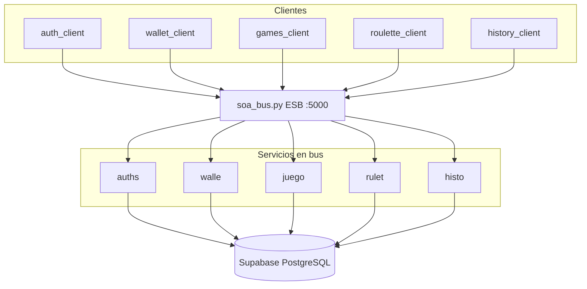

# Casino Monticello Virtual — Documentación

## 1. Equipo y curso

- **Curso:** Arquitectura de Software
- **Profesor:** Juan Giadach
- **Integrantes:**
  - Bastian Lobos
  - Ignacio Pastén
  - Ignacio Gutierrez
  - Vicente Leiva

---

## 2. Alcance de la implementación

Este repositorio consiste en el **proyecto del equipo**: desarrollo, implementación y documentación de la arquitectura SOA del Casino Monticello Virtual.


| Servicio          | Endpoint     | Rol                                        |
| ----------------- | ------------ | ------------------------------------------ |
| Usuarios          | `/auth`      | Registro y autenticación (RF-01)           |
| Billetera virtual | `/wallet`    | Saldo, depósitos y retiros (RF-02)         |
| Juegos            | `/juegos`    | Catálogo y sesión de juego (RF-04)         |
| Apuestas          | `/apuesta`   | Motor de apuestas y resultados (RF-05)     |
| Historial         | `/historial` | Movimientos y apuestas del usuario (RF-03) |


**Servicios y clientes implementados**


| Informe             | Nombre en bus | Servicio                       | Cliente                     | RF    |
| ------------------- | ------------- | ------------------------------ | --------------------------- | ----- |
| `/auth`             | `auths`       | `services/auth_service.py`     | `client/auth_client.py`     | RF-01 |
| `/wallet`           | `walle`       | `services/wallet_service.py`   | `client/wallet_client.py`   | RF-02 |
| `/juegos`           | `juego`       | `services/games_service.py`    | `client/games_client.py`    | RF-04 |
| `/apuesta` (ruleta) | `rulet`       | `services/roulette_service.py` | `client/roulette_client.py` | RF-05 |
| `/historial`        | `histo`       | `services/history_service.py`  | `client/history_client.py`  | RF-03 |


Además: **ESB** (`soa/soa_bus.py`), **protocolo** (`soa/soa_lib.py`) y **persistencia** Supabase (`db/`).

Se pidió **al menos un servicio funcional**, este repositorio entrega **los cinco** del diagrama SOA indicados en el informe. La **ruleta** (`rulet`) es el caso más completo (motor de juego + apuestas + premios). Saldo, depósitos y retiros se delegan al servicio `walle`, y el cliente de ruleta consulta saldo vía `walle`, no duplicando lógica de billetera.

---

## 3. Arquitectura SOA implementada

El sistema sigue el modelo visto en clases: **clientes** y **servicios** desacoplados, comunicándose únicamente a través del **Enterprise Service Bus (ESB)**. Ningún cliente accede directamente a la base de datos.




### 3.1 Rol de cada capa


| Capa                     | Ubicación                     | Responsabilidad                                                                                                  |
| ------------------------ | ----------------------------- | ---------------------------------------------------------------------------------------------------------------- |
| **ESB**                  | `soa/soa_bus.py`              | Registra servicios (`sinit`), enruta peticiones cliente -> servicio y respuestas servicio -> cliente             |
| **Librería de mensajes** | `soa/soa_lib.py`              | Framing TCP: largo (5 dígitos) + nombre de servicio (5 chars) + payload                                          |
| **Clientes**             | `client/*_client.py`          | Un proceso cliente por servicio; invocan solo vía bus                                                            |
| **Servicios**            | `services/*_service.py`       | Un proceso por servicio; registro `sinit` y respuesta JSON                                                       |
| **Lógica de ruleta**     | `services/roulette_engine.py` | Sorteo 0–36 y evaluación de apuestas (solo `rulet`)                                                              |
| **Capa DA**              | `db/*_repository.py`          | Acceso a PostgreSQL, donde ningún cliente la utiliza directamente                                                |
| **Persistencia**         | Supabase (PostgreSQL 16)      | Tablas del modelo del informe: `usuarios`, `billeteras`, `juegos`, `sesiones_juego`, `apuestas`, `transacciones` |


### 3.2 Archivos obligatorios y el bus SOA

**Se usan** los archivos que entregó el profesor para implementar el bus SOA. Resumen:


| Archivo                            | ¿Cómo lo usa Monticello?                                                                                    |
| ---------------------------------- | ----------------------------------------------------------------------------------------------------------- |
| `soa/soa_lib.py` (obligatorio)     | **En uso directo**: todos los clientes y servicios envían y reciben mensajes con sus funciones              |
| `soa/soa_service.py` (obligatorio) | **Referencia**: el registro `sinit` y el bucle de respuesta se replican en `services/soa_service_runner.py` |
| `soa/soa_client.py` (obligatorio)  | **Referencia**: la forma de invocar el bus se replican en `client/soa_invoke.py`                            |
| `soa/soa_bus.py`                   | ESB agregado por el equipo, pero construido **solo** con `send_message` / `receive_message` de `soa_lib.py` |


Los ejemplos `soa_client.py` y `soa_service.py` siguen en el repo como laboratorio (`servi`). La ruleta y el resto de servicios usan el **mismo protocolo**, sin editar esos tres archivos obligatorios.

### 3.3 Conceptos aplicados


| Concepto                  | Implementación                                                                     |
| ------------------------- | ---------------------------------------------------------------------------------- |
| ESB como mediador central | `soa_bus.py` concentra todo el enrutamiento                                        |
| Servicios como caja negra | Cada cliente solo conoce el nombre de su servicio (`auths`, `walle`, etc.)         |
| Bajo acoplamiento         | Sin acceso directo del cliente a PostgreSQL                                        |
| Registro de servicios     | Mensaje inicial `sinit` + nombre del servicio                                      |
| Punto único de falla      | Si el bus no está en ejecución, no hay comunicación (trade-off documentado de SOA) |


---

## 4. Persistencia: PostgreSQL en Supabase

La persistencia definida en el informe (PostgreSQL, repositorio compartido entre servicios, acceso solo vía capa DA) se implementa con **Supabase** como hosting de PostgreSQL.

### 4.1 Conexión


| Parámetro     | Valor                                       |
| ------------- | ------------------------------------------- |
| Host          | `db.yxobdkldjhinxmwfsure.supabase.co`       |
| Puerto        | `5432`                                      |
| Base de datos | `postgres`                                  |
| Usuario       | `postgres`                                  |
| Contraseña    | Variable de entorno `DB_PASSWORD` en `.env` |


La URL se construye en `db/connection.py` con `sslmode=require`, usando un pool de conexiones (`ThreadedConnectionPool`).

### 4.2 Configuración local

1. Copiar la plantilla: `copy .env.example .env` (Windows) o `cp .env.example .env` (Linux/macOS).
2. Editar `.env` y definir solo:

```env
DB_PASSWORD=password_de_supabase
```

1. Verificar conexión e inicializar tablas y datos demo:

```bash
python db/test_connection.py
python db/init_database.py
```

`db/schema.sql` crea las tablas del modelo. `db/seed.sql` inserta un usuario demo (`id_usuario = 1`) con saldo inicial de **$50.000 CLP** y el juego **Ruleta Europea**.

### 4.3 Scripts de base de datos


| Script                  | Función                                         |
| ----------------------- | ----------------------------------------------- |
| `db/test_connection.py` | Prueba `SELECT NOW()` contra Supabase           |
| `db/init_database.py`   | Ejecuta `schema.sql` y `seed.sql`               |
| `db/connection.py`      | Pool y resolución de URL                        |
| `db/*_repository.py`    | Capa DA por dominio (auth, wallet, games, etc.) |


---

## 5. Protocolo del bus SOA

El protocolo viene de `soa/soa_lib.py` (archivo obligatorio del curso). El ESB (`soa_bus.py`), cada servicio en `services/` y cada cliente en `client/` lo reutilizan sin cambiar esa librería.

### 5.1 Formato de mensaje

Cada mensaje TCP tiene tres partes:

1. **Largo** - 5 dígitos decimales (longitud del contenido siguiente).
2. **Destino** - 5 caracteres (nombre del servicio, ej. `rulet`, `sinit`).
3. **Payload** - cuerpo en texto (UTF-8).

El bus escucha en `localhost:5000`.

### 5.2 Convención de nombres en el bus

Se recibió el protocolo en `soa/soa_lib.py`: cada mensaje concatena **nombre de servicio + payload**, y al leerlo se separa en **5 caracteres de destino** + resto (`data[:5]` / `data[5:]`). Por eso el ejemplo usa `servi` y el cliente hace `data[5:].decode()` en `soa/soa_client.py`.

En Monticello cada servicio expone un `SERVICE_NAME` de **exactamente 5 caracteres** en el bus (`rulet`, `walle`, `auths`…).


| Archivo              | Rol respecto a los 5 caracteres                                 |
| -------------------- | --------------------------------------------------------------- |
| `soa/soa_lib.py`     | Arma y envía mensajes (`service_name` + payload)                |
| `soa/soa_service.py` | Servicio ejemplo registrado como `servi`                        |
| `soa/soa_client.py`  | Invoca `servi`; omite los 5 primeros chars al leer la respuesta |


El **ESB** `soa/soa_bus.py` lo implementó el equipo después, aplicando la misma regla (`data[:5]` destino, `data[5:]` cuerpo) para enrutar clientes y servicios.

### 5.3 Registro del servicio

Al iniciar, el proceso servicio envía:

- Destino: `sinit`
- Payload: nombre del servicio (`rulet`)

El bus responde con destino `sinit` y payload `OK`, y queda el servicio registrado para recibir tráfico.

### 5.4 Flujo cliente -> servicio -> cliente

1. El cliente se conecta al bus y envía un mensaje con destino de 5 caracteres (ej. `walle`).
2. El bus reenvía el payload al servicio registrado.
3. El servicio procesa la solicitud (y accede a Supabase si corresponde).
4. El servicio responde al bus con su mismo nombre y cuerpo JSON.
5. El bus devuelve la respuesta al cliente que esperaba.

Todas las respuestas de servicios usan JSON: `{"ok": bool, "message": str, ...}`.

### 5.5 Usuario demo

Tras `python db/init_database.py`:


| Dato          | Valor                |
| ------------- | -------------------- |
| Correo        | `demo@monticello.cl` |
| Contraseña    | `demo123`            |
| `id_usuario`  | `1`                  |
| Saldo inicial | $50.000 CLP          |


---

## 6. Servicios implementados (detalle)

### 6.1 Autenticación - `auths` (RF-01)

**Servicio:** `services/auth_service.py` · **Cliente:** `client/auth_client.py`


| Acción   | Payload de ejemplo |
| -------- | ------------------ |
| Login    | `LOGIN             |
| Registro | `REGIST            |


Comandos cliente: `login <correo> <password>`, `registro <rut> <nombre> <apellido> <correo> <password>`, `usuario`, `salir`.

### 6.2 Billetera - `walle` (RF-02)

**Servicio:** `services/wallet_service.py` · **Cliente:** `client/wallet_client.py`


| Acción   | Payload de ejemplo |
| -------- | ------------------ |
| Saldo    | `SALDO             |
| Depósito | `DEPOS             |
| Retiro   | `RETIR             |


Comandos cliente: `saldo [user_id]`, `depositar <monto>`, `retirar <monto>`, `salir`.

### 6.3 Juegos - `juego` (RF-04)

**Servicio:** `services/games_service.py` · **Cliente:** `client/games_client.py`


| Acción         | Payload de ejemplo |
| -------------- | ------------------ |
| Catálogo       | `LIST`             |
| Iniciar sesión | `START             |


Comandos cliente: `listar`, `iniciar <id_juego> [user_id]`, `salir`.

El catálogo incluye juegos `ruleta`, `tragamonedas` y `grupal` (semilla en `db/seed.sql`).

### 6.4 Apuestas (ruleta) - `rulet` (RF-05) - servicio principal

**Servicio:** `services/roulette_service.py` · **Motor:** `services/roulette_engine.py` · **Cliente:** `client/roulette_client.py`

El saldo se consulta con el servicio `walle` (no en `rulet`), alineado con la separación de servicios.

**Apuesta (`SPIN`)** - campos: `acción`, `id_usuario`, `monto`, `tipo`, `valor`

```
SPIN|1|1000|rojo|
SPIN|1|500|numero|7
```

**Tipos de apuesta (`tipo`):**


| Tipo     | Valor (`valor`) | Pago |
| -------- | --------------- | ---- |
| `rojo`   | vacío           | 1:1  |
| `negro`  | vacío           | 1:1  |
| `par`    | vacío           | 1:1  |
| `impar`  | vacío           | 1:1  |
| `numero` | entero 0–36     | 35:1 |


El sorteo es aleatorio entre 0 y 36 (ruleta europea). El 0 es verde; en apuestas rojo/negro/par/impar no gana.

Ejemplo de respuesta:

```json
{
  "ok": true,
  "message": "Numero 17 (negro). perdiste.",
  "winning_number": 17,
  "color": "negro",
  "won": false,
  "prize": 0,
  "balance": 49000.0,
  "bet_id": 1,
  "session_id": 1
}
```

### 6.5 Persistencia de cada apuesta (`rulet`)

Por cada `SPIN` exitoso, en una sola transacción:

1. Se valida saldo en `billeteras`.
2. Se debita el monto apostado.
3. Se registra la fila en `apuestas` (con `detalle_json`: número, color, tipo de apuesta).
4. Se registra transacción tipo `apuesta`.
5. Si hay premio, se acredita saldo y se registra transacción tipo `premio`.

Esto materializa la trazabilidad financiera (apuesta y transacción).

### 6.6 Historial - `histo` (RF-03)

**Servicio:** `services/history_service.py` · **Cliente:** `client/history_client.py`


| Acción             | Payload de ejemplo |
| ------------------ | ------------------ |
| Listar movimientos | `LIST              |


Comandos cliente: `listar [user_id] [limite]`, `salir`.

Incluye transacciones de depósito, retiro, apuesta y premio vinculadas a apuestas cuando aplica.

### 6.7 Requerimientos no funcionales (global)


| Atributo          | Tratamiento                                             |
| ----------------- | ------------------------------------------------------- |
| Atomicidad        | Transacciones con `FOR UPDATE` en billetera y apuestas  |
| Seguridad         | Solo `DB_PASSWORD` en `.env` y clientes sin acceso a BD |
| Disponibilidad    | Requiere bus activo y Supabase en línea                 |
| Bajo acoplamiento | Cinco procesos servicio independientes en el mismo bus  |


---

## 7. Clientes e interfaces

Cada servicio del informe tiene un **proceso cliente** de consola invocable de forma independiente:


| Interfaz                   | Cliente                     | Servicio en bus                |
| -------------------------- | --------------------------- | ------------------------------ |
| Login / registro           | `client/auth_client.py`     | `auths`                        |
| Saldo, depósito, retiro    | `client/wallet_client.py`   | `walle`                        |
| Catálogo y sesión de juego | `client/games_client.py`    | `juego`                        |
| Apuesta en ruleta          | `client/roulette_client.py` | `rulet` (+ `walle` para saldo) |
| Historial financiero       | `client/history_client.py`  | `histo`                        |


Comandos del cliente ruleta: `saldo` (vía `walle`), `apostar rojo 1000`, `apostar numero 7 500`, `ayuda`, `salir`.

---

## 8. Estructura del proyecto

```
monticello-soa/
├── .env.example
├── requirements.txt
├── README.md
├── soa/
│   ├── soa_bus.py
│   ├── soa_lib.py
│   ├── soa_client.py
│   └── soa_service.py
├── services/
│   ├── soa_service_runner.py
│   ├── soa_response.py
│   ├── auth_service.py          # auths
│   ├── wallet_service.py        # walle
│   ├── games_service.py         # juego
│   ├── history_service.py       # histo
│   ├── roulette_service.py      # rulet
│   └── roulette_engine.py
├── client/
│   ├── soa_invoke.py
│   ├── auth_client.py
│   ├── wallet_client.py
│   ├── games_client.py
│   ├── history_client.py
│   └── roulette_client.py
└── db/
    ├── connection.py
    ├── schema.sql
    ├── seed.sql
    ├── init_database.py
    ├── test_connection.py
    ├── auth_repository.py
    ├── wallet_repository.py
    ├── games_repository.py
    ├── history_repository.py
    └── roulette_repository.py
```

---

## 9. Requisitos e instalación

- **Python** 3.10 o superior
- **Cuenta Supabase** con PostgreSQL activo y contraseña de base de datos
- **Red** para conectar a `db.yxobdkldjhinxmwfsure.supabase.co:5432`

```bash
pip install -r requirements.txt
```

Configurar `.env` como en la sección 4.2 y ejecutar los scripts de base de datos antes de levantar el sistema SOA.

---

## 10. Ejecución del sistema

Desde la raíz del proyecto (`monticello-soa/`).

### Paso 1 - Bus SOA (siempre primero)

```bash
cd soa
python soa_bus.py
```

### Paso 2 - Servicios (5 terminales, una por servicio)

Desde la raíz del proyecto, en cada terminal:

```bash
python services/auth_service.py
python services/wallet_service.py
python services/games_service.py
python services/history_service.py
python services/roulette_service.py
```

Cada proceso debe mostrar registro exitoso en el bus (`auths`, `walle`, `juego`, `histo`, `rulet`).

### Paso 3 - Clientes

```bash
python client/auth_client.py
python client/wallet_client.py
python client/games_client.py
python client/history_client.py
python client/roulette_client.py
```

---

*Documentación - Casino Monticello Virtual*